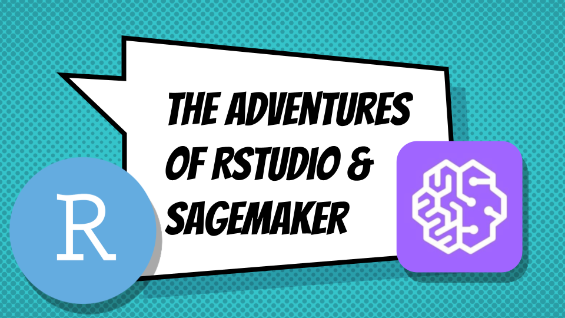

# RStudio and Sagemaker

A webinar about using RStudio with Amazon Sagemaker. The examples in this webinar draw heavily from the [SageMaker and R examples provided by Amazon](https://github.com/aws/amazon-sagemaker-examples/tree/master/r_examples).

